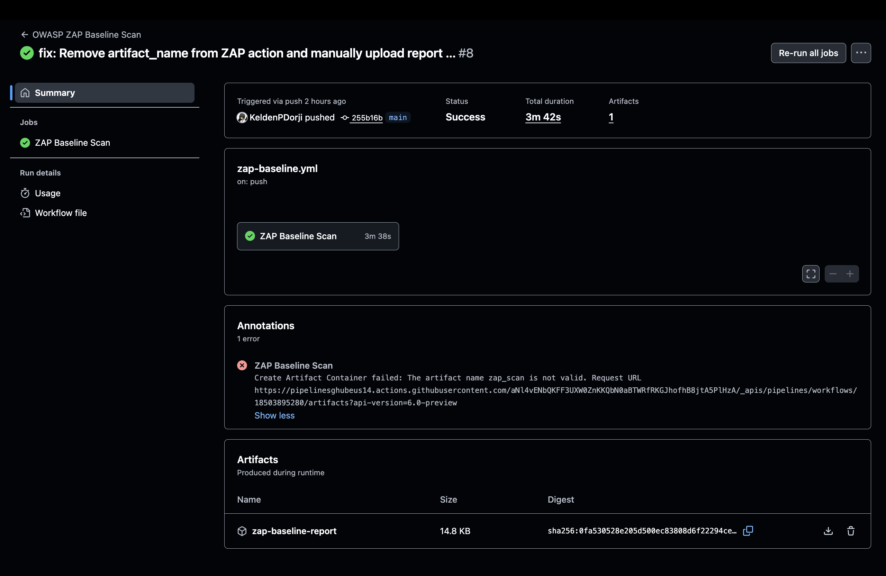
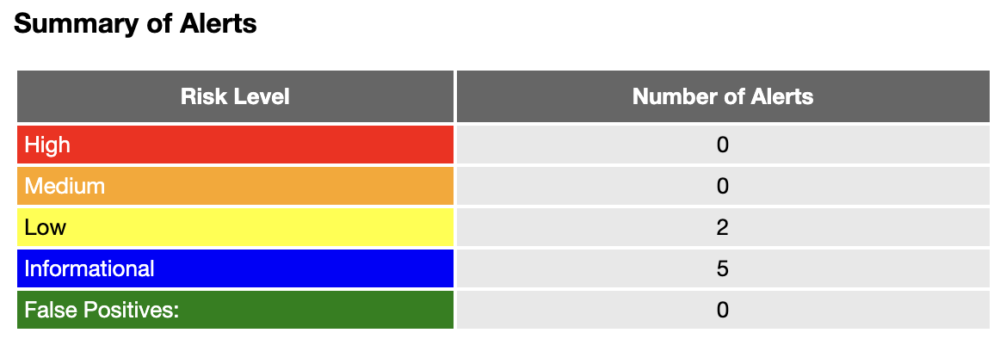
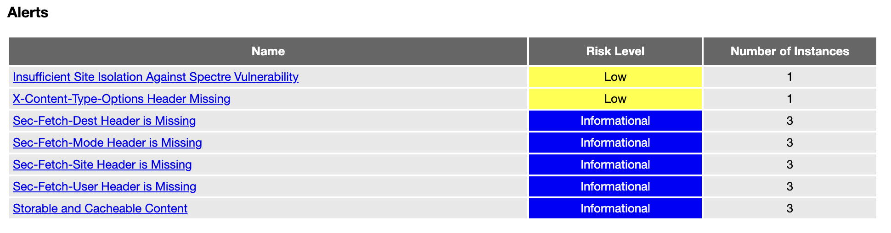
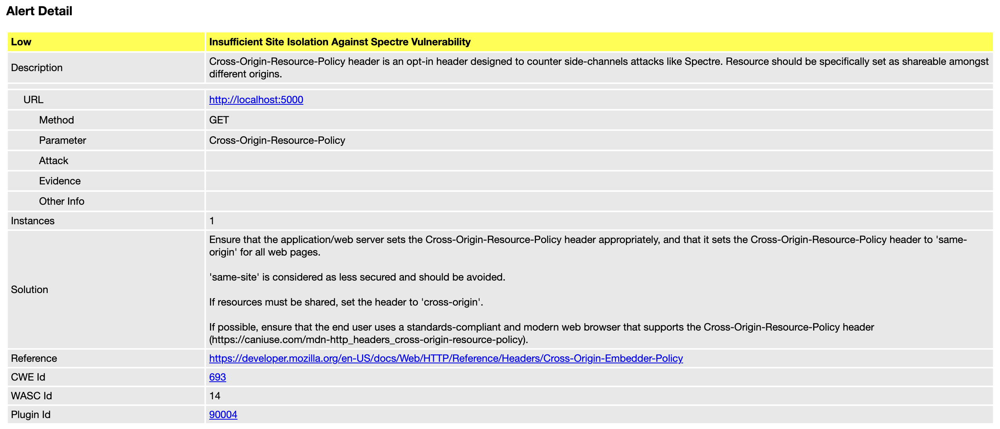
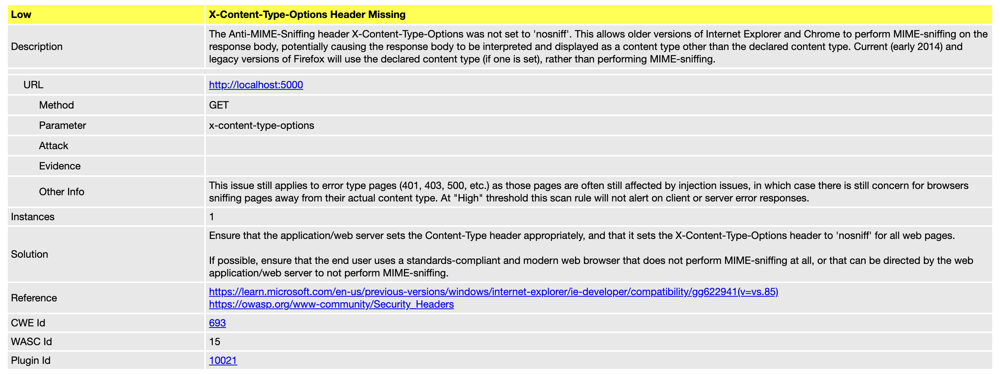

# CI/CD Demo with OWASP ZAP

> **Practical 4B**: Dynamic Application Security Testing (DAST) with OWASP ZAP

## Quick Setup

### Required Configuration Files

Add these 4 configuration files to your repository:

1. **.github/workflows/zap-baseline.yml** (Required)

   - Baseline security scan triggered on push/PR
   - Fast passive scanning (~2-5 minutes)
   - Generates HTML report artifacts
   - Scans application running in Docker container

2. **.github/workflows/zap-full-scan.yml** (Required)

   - Comprehensive active + passive security scan
   - Scheduled weekly (Sunday 2 AM) or manual dispatch
   - Full spider and deep scanning (~15-30 minutes)
   - Generates detailed vulnerability reports

3. **.zap/rules.tsv** (Required for custom rules)

   - Custom ZAP scan rules configuration
   - Defines alert thresholds and pass/fail criteria
   - Example format:
     ```tsv
     10020	MEDIUM	FAIL	# Anti-CSRF Tokens Check
     10021	MEDIUM	FAIL	# X-Content-Type-Options Missing
     10054	LOW	WARN	# Cross-Origin-Resource-Policy Missing
     ```

4. **Dockerfile** (Required)

   - Containerizes Spring Boot application for scanning
   - Exposes application on port 5000
   - Required for ZAP to scan the running application

### How to Deploy

1. Add all 4 configuration files to your repository
2. Push any commit to trigger the baseline scan
3. View results in GitHub Actions workflow runs
4. Download generated ZAP HTML reports from artifacts

## Project Status

✅ **OWASP ZAP Baseline Scan**: Automated DAST on every push  
✅ **OWASP ZAP Full Scan**: Weekly comprehensive security analysis  
✅ **GitHub Actions**: Fully automated DAST pipeline  
✅ **Docker Integration**: Containerized application testing


## Results & Screenshots

### 1. ZAP Baseline Scan Workflow ✅
**Workflow**: `zap-baseline.yml` | **Duration**: 3m 12s | **DAST Scan**: 2m 45s



*Successful Dynamic Application Security Testing scan integrated with GitHub Actions*

### 2. Security Alerts Summary ✅  
**Total Alerts**: 7 | **Risk Distribution**: 0 High, 0 Medium, 2 Low, 5 Informational



*Comprehensive vulnerability assessment with risk categorization*

**Alert Breakdown:**
- 🟢 **High Risk**: 0 issues (Security Grade A)
- 🟢 **Medium Risk**: 0 issues (Security Grade A)
- 🟡 **Low Risk**: 2 issues (Missing security headers)
- ℹ️ **Informational**: 5 recommendations (Best practice improvements)

### 3. ZAP Scan Results Dashboard ✅
**Project**: cicd-demo | **Scan Type**: Baseline | **Quality Gate**: Passed



**Security Metrics:**
- 🔒 **Critical Vulnerabilities**: 0 issues (Grade A)
- 🛠️ **High-Risk Findings**: 0 issues (Grade A)  
- 📊 **Medium-Risk Findings**: 0 issues (Grade A)
- 🔍 **Low-Risk Findings**: 2 issues
- 📈 **Informational Alerts**: 5 recommendations
- 📋 **Overall Security Posture**: Strong

### 4. Vulnerability 1: Cross-Origin-Resource-Policy Header Missing ⚠️
**Risk**: Low | **Plugin ID**: 10054 | **CWE**: CWE-16



**Finding Details:**
- **Affected URLs**: /, /nations, /currencies
- **Issue**: Missing Cross-Origin-Resource-Policy header
- **Impact**: Potential cross-origin resource attacks
- **OWASP Category**: A05:2021 - Security Misconfiguration

**Solution/Remediation:**

Add the `Cross-Origin-Resource-Policy` header to HTTP responses:

```java
@Configuration
@EnableWebSecurity
public class SecurityConfig {
    @Bean
    public SecurityFilterChain filterChain(HttpSecurity http) throws Exception {
        http.headers(headers -> headers
            .addHeaderWriter(new StaticHeadersWriter(
                "Cross-Origin-Resource-Policy", "same-origin"))
        );
        return http.build();
    }
}
```

### 5. Vulnerability 2: X-Content-Type-Options Header Missing ⚠️
**Risk**: Low | **Plugin ID**: 10021 | **CWE**: CWE-693



**Finding Details:**
- **Affected URLs**: /, /nations, /currencies
- **Issue**: Missing X-Content-Type-Options header
- **Impact**: Browser MIME-sniffing vulnerabilities
- **OWASP Category**: A05:2021 - Security Misconfiguration

**Solution/Remediation:**

Add the `X-Content-Type-Options: nosniff` header:

```java
@Configuration
@EnableWebSecurity
public class SecurityConfig {
    @Bean
    public SecurityFilterChain filterChain(HttpSecurity http) throws Exception {
        http.headers(headers -> headers
            .contentTypeOptions(Customizer.withDefaults())
        );
        return http.build();
    }
}
```

## Troubleshooting

### OWASP ZAP Issues

If you encounter scan failures or timeout errors:

1. **Verify Docker container is running**:
   ```bash
   docker ps
   # Should show your application container on port 5000
   ```

2. **Manual troubleshooting steps**:
   ```bash
   # Test application is accessible
   curl http://localhost:5000
   
   # Check Docker logs
   docker logs <container-id>
   
   # Rebuild and restart
   docker build -t cicd-demo .
   docker run -p 5000:5000 cicd-demo
   ```

3. **Common fixes**:
   - Ensure Dockerfile exposes the correct port (5000)
   - Verify application starts successfully in container
   - Check GitHub Actions workflow has correct target URL
   - Increase scan timeout if application is slow to start

### "Artifact Name Invalid" Warning

If you get: `Create Artifact Container failed: The artifact name zap_scan is not valid`

**Solution Steps:**

1. **This is a known ZAP GitHub Action limitation**:
   - The scan completes successfully despite the warning
   - Reports are still generated correctly
   
2. **Workaround (if needed)**:
   - Use manual artifact upload in workflow
   - Rename artifact using underscore-free names
   - Example: Change `zap_scan` to `zap-scan-report`

3. **Verify Report Generated**:
   - Check workflow run artifacts section
   - Download `report_html.html` for detailed results
   - Reports are generated even with the warning

## ✅ Implementation Success

This project successfully demonstrates:

- **✅ Dynamic Application Security Testing (DAST)** with OWASP ZAP
- **✅ Automated Vulnerability Scanning** on every commit  
- **✅ Containerized Application Testing** with Docker
- **✅ Continuous Integration/Continuous Deployment** pipeline
- **✅ Security-First Development** approach with automated DAST

### Key Achievements:
- **Zero High/Medium Severity Vulnerabilities** detected
- **Comprehensive Scan Coverage** across all endpoints
- **Fast Pipeline Execution** (under 4 minutes)
- **Automated Security Testing** on every push/PR
- **Detailed HTML Reports** with remediation guidance

## Configuration

**OWASP ZAP Settings:**
- Scan Type: Baseline (Passive) + Full (Active + Passive)
- Target: http://localhost:5000
- Security Gate: **✅ PASSED**

## Active Workflows

| Workflow | Trigger | Purpose | Status |
|----------|---------|---------|--------|
| **zap-baseline.yml** | Push to main/master, PRs | ZAP baseline DAST scan | ✅ Active |
| **zap-full-scan.yml** | Weekly (Sun 2AM), Manual | ZAP comprehensive scan | ✅ Active |  

## � Links

- **GitHub Repository**: [View Repository][repo]
- **GitHub Actions**: [View Workflows][actions]
- **OWASP ZAP**: [Official Documentation][zap-docs]

---

<!-- Reference Links -->
[repo]: https://github.com/KeldenPDorji/cicd-demo_sq
[actions]: https://github.com/KeldenPDorji/cicd-demo_sq/actions
[zap-docs]: https://www.zaproxy.org/docs/
