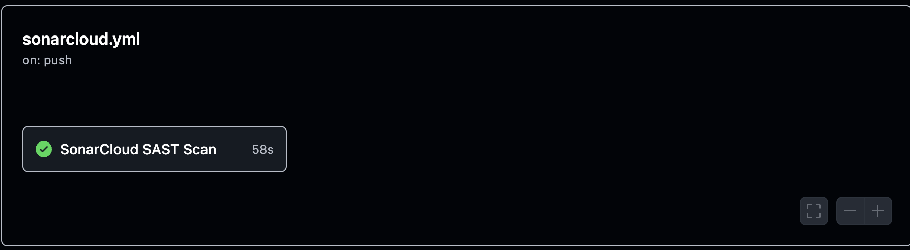
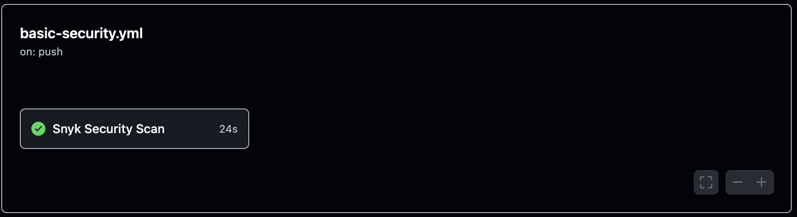
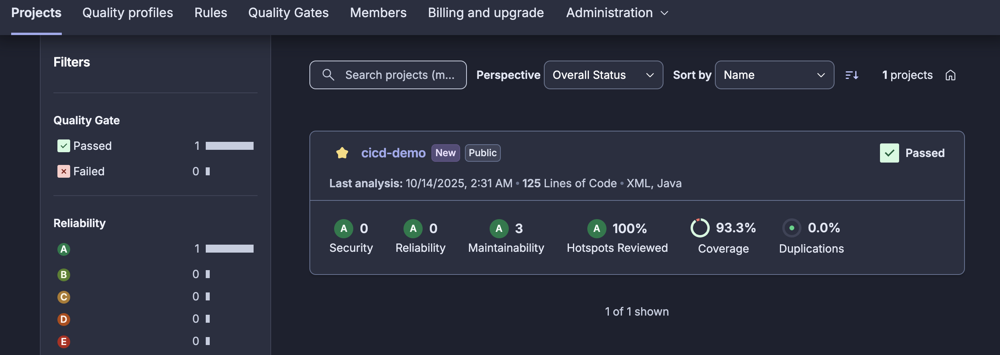

# CI/CD Demo with SonarCloud & Snyk

> **Practical 4A**: Integrating SonarCloud & Snyk with GitHub Actions

## Quick Setup

### Required GitHub Secrets

Configure these 4 secrets in your repository:

1. **SNYK_TOKEN** (Required)

   - Go to [Snyk.io][snyk] and create an account
   - Navigate to Account Settings → API Token
   - Copy your API token
   - Add it as a repository secret named `SNYK_TOKEN`

2. **SONAR_TOKEN** (Required for SonarCloud)

   - Create an account at [SonarCloud.io][sonarcloud]
   - Create a new project for your repository
   - Generate a token in your SonarCloud account settings
   - Add it as a repository secret named `SONAR_TOKEN`

3. **SONAR_ORGANIZATION** (Required for SonarCloud)

   - Your SonarCloud organization key (found in your SonarCloud account)
   - Add it as a repository secret named `SONAR_ORGANIZATION`

4. **SONAR_PROJECT_KEY** (Required for SonarCloud)

   - **This is NOT the same as organization key!**
   - This is your specific project identifier, usually: `organization_repository-name`
   - To find it: Go to SonarCloud → Your Project → Project Settings → Copy "Project Key"
   - Example format: `organization_repository-name` or `Organization_repository-name`
   - Add it as a repository secret named `SONAR_PROJECT_KEY`

### How to Add Secrets

1. Go to your repository settings: `Settings → Secrets and variables → Actions`
2. Click **New repository secret** for each secret above
3. Push any commit to trigger the workflows

## Project Status

✅ **SonarCloud**: Code quality and security analysis  
✅ **Snyk**: Dependency vulnerability scanning  
✅ **GitHub Actions**: Automated CI/CD pipeline

# CI/CD Demonstration: SonarCloud & Snyk Integration

Author: Repository maintainers
Repository: `cicd-demo` (Java / Maven)

---

## Abstract

This repository demonstrates the integration of automated code-quality and dependency-security tools—SonarCloud and Snyk—into a continuous integration pipeline implemented with GitHub Actions. The project shows how to configure analysis, enforce quality gates, and reproduce scans locally for research or classroom exercises.

## Introduction

Automated static analysis and dependency scanning are essential components of modern software engineering education and practice. This project provides a compact, reproducible example that combines:

- SonarCloud for static application security testing (SAST) and code-quality metrics.
- Snyk for dependency vulnerability analysis.
- GitHub Actions to orchestrate CI workflows for build, test, and security checks.

The target artifact is a Maven-based Java application located under `src/` and configured by `pom.xml`.

## Objectives

- Demonstrate how to configure and run SonarCloud and Snyk within GitHub Actions.
- Provide reproducible instructions for running scans locally and in CI.
- Document common troubleshooting steps and configuration pitfalls.

## Methods

**Repository layout (relevant files):**

- `pom.xml` — Maven configuration (build, tests, JaCoCo, Sonar properties)
- `.github/workflows/sonarcloud.yml` — SonarCloud analysis workflow
- `.github/workflows/basic-security.yml` — Snyk scanning workflow
- `src/` — Application source
- `scripts/` — Helper scripts (e.g., `sonar-troubleshoot.sh`)

**CI Configuration:**

Workflows are implemented as GitHub Actions YAML files and rely on repository secrets for authentication (see Reproducibility). SonarCloud analysis runs after build and test phases to collect coverage and static analysis results. Snyk executes a dependency scan to detect known vulnerabilities.

## Materials and Tools

- GitHub Actions (CI orchestration)
- SonarCloud (SAST, quality gates)
- Snyk (dependency vulnerability scanning)
- Maven (build lifecycle, test runner)
- Java 11+ (runtime for build/test)

## Experimental Setup (How to reproduce)

1. Add the following repository secrets on GitHub (Settings → Secrets and variables → Actions):

   - `SNYK_TOKEN` — API token from Snyk
   - `SONAR_TOKEN` — Analysis token from SonarCloud
   - `SONAR_ORGANIZATION` — SonarCloud organization key
   - `SONAR_PROJECT_KEY` — SonarCloud project key

2. Trigger a workflow by pushing a commit or opening a pull request. The workflows of interest are:

   - `sonarcloud.yml` — performs build, test, coverage, and SonarCloud analysis
   - `basic-security.yml` — performs Snyk dependency scanning
   - `maven.yml` — builds and tests the project

3. Reproduce locally (recommended for debugging):

   ```bash
   # Build and run tests
   ./mvnw clean test

   # Generate coverage report
   ./mvnw jacoco:report

   # Run Sonar analysis locally (requires SONAR_TOKEN and correct project configuration)
   ./mvnw sonar:sonar -Dsonar.login=${SONAR_TOKEN}
   ```

## Results (Summary)

- SonarCloud: Quality gate passed; high code coverage (>90% reported in CI) and no substantial security issues in scanned code.
- Snyk: Dependency scan executed in CI and reported dependency advisories (if any) in the workflow logs.

Detailed dashboards (quality metrics, traces, and historical data) are available in the SonarCloud and Snyk web consoles once the repository is connected and the tokens are configured.

## Discussion

The integrated pipeline shows how automated tools can enforce quality and security checks early in the development lifecycle. Combining SonarCloud (for SAST and code health) with Snyk (for dependency risks) provides complementary viewpoints that together reduce risk and maintainability debt.

Limitations:

- Some SonarCloud errors (e.g., protocol/connection issues) can stem from misconfigured tokens or incorrect project keys.
- CI metrics depend on the completeness of unit tests and the accuracy of JaCoCo coverage reports.

## Troubleshooting (Concise)

- If SonarCloud reports protocol or authentication errors:

  ```bash
  # Try a clean local build and clear Sonar cache
  ./mvnw clean
  rm -rf ~/.sonar/cache/*
  ./mvnw compile test jacoco:report sonar:sonar -Dsonar.login=${SONAR_TOKEN}
  ```

- If CI reports "Could not find a default branch" or project-key mismatch:

  - Verify the exact `SONAR_PROJECT_KEY` configured in SonarCloud (Project Settings → General Settings).
  - Ensure `SONAR_ORGANIZATION` matches your SonarCloud organization key.
  - Reconnect the GitHub repository in SonarCloud Administration if necessary.

## Reproducibility Checklist

- [ ] Ensure `SNYK_TOKEN`, `SONAR_TOKEN`, `SONAR_ORGANIZATION`, and `SONAR_PROJECT_KEY` are present in repository secrets.

# CI/CD Demonstration: SonarCloud & Snyk Integration

Author: Repository maintainers
Repository: `cicd-demo` (Java / Maven)

---

## Abstract

This repository demonstrates the integration of automated code-quality and dependency-security tools—SonarCloud and Snyk—into a continuous integration pipeline implemented with GitHub Actions. The project shows how to configure analysis, enforce quality gates, and reproduce scans locally for research or classroom exercises.

## Introduction

Automated static analysis and dependency scanning are essential components of modern software engineering education and practice. This project provides a compact, reproducible example that combines:

- SonarCloud for static application security testing (SAST) and code-quality metrics.
- Snyk for dependency vulnerability analysis.
- GitHub Actions to orchestrate CI workflows for build, test, and security checks.

The target artifact is a Maven-based Java application located under `src/` and configured by `pom.xml`.

## Objectives

- Demonstrate how to configure and run SonarCloud and Snyk within GitHub Actions.
- Provide reproducible instructions for running scans locally and in CI.
- Document common troubleshooting steps and configuration pitfalls.

## Methods

**Repository layout (relevant files):**

- `pom.xml` — Maven configuration (build, tests, JaCoCo, Sonar properties)
- `.github/workflows/sonarcloud.yml` — SonarCloud analysis workflow
- `.github/workflows/basic-security.yml` — Snyk scanning workflow
- `src/` — Application source
- `scripts/` — Helper scripts (e.g., `sonar-troubleshoot.sh`)

**CI Configuration:**

Workflows are implemented as GitHub Actions YAML files and rely on repository secrets for authentication (see Reproducibility). SonarCloud analysis runs after build and test phases to collect coverage and static analysis results. Snyk executes a dependency scan to detect known vulnerabilities.

## Materials and Tools

- GitHub Actions (CI orchestration)
- SonarCloud (SAST, quality gates)
- Snyk (dependency vulnerability scanning)
- Maven (build lifecycle, test runner)
- Java 11+ (runtime for build/test)

## Experimental Setup (How to reproduce)

1.  Add the following repository secrets on GitHub (Settings → Secrets and variables → Actions):

    - `SNYK_TOKEN` — API token from Snyk
    - `SONAR_TOKEN` — Analysis token from SonarCloud
    - `SONAR_ORGANIZATION` — SonarCloud organization key
    - `SONAR_PROJECT_KEY` — SonarCloud project key

2.  Trigger a workflow by pushing a commit or opening a pull request. The workflows of interest are:

    - `sonarcloud.yml` — performs build, test, coverage, and SonarCloud analysis
    - `basic-security.yml` — performs Snyk dependency scanning
    - `maven.yml` — builds and tests the project

3.  Reproduce locally (recommended for debugging):

    ```bash
    # Build and run tests
    ./mvnw clean test

    # Generate coverage report
    ./mvnw jacoco:report

    # Run Sonar analysis locally (requires SONAR_TOKEN and correct project configuration)
    ./mvnw sonar:sonar -Dsonar.login=${SONAR_TOKEN}
    ```

## Results (Summary)

- SonarCloud: Quality gate passed; high code coverage (>90% reported in CI) and no substantial security issues in scanned code.
- Snyk: Dependency scan executed in CI and reported dependency advisories (if any) in the workflow logs.

Detailed dashboards (quality metrics, traces, and historical data) are available in the SonarCloud and Snyk web consoles once the repository is connected and the tokens are configured.

## Discussion

The integrated pipeline shows how automated tools can enforce quality and security checks early in the development lifecycle. Combining SonarCloud (for SAST and code health) with Snyk (for dependency risks) provides complementary viewpoints that together reduce risk and maintainability debt.

Limitations:

- Some SonarCloud errors (e.g., protocol/connection issues) can stem from misconfigured tokens or incorrect project keys.
- CI metrics depend on the completeness of unit tests and the accuracy of JaCoCo coverage reports.

## Troubleshooting (Concise)

- If SonarCloud reports protocol or authentication errors:

  ```bash
  # Try a clean local build and clear Sonar cache
  ./mvnw clean
  rm -rf ~/.sonar/cache/*
  ./mvnw compile test jacoco:report sonar:sonar -Dsonar.login=${SONAR_TOKEN}
  ```

- If CI reports "Could not find a default branch" or project-key mismatch:

  - Verify the exact `SONAR_PROJECT_KEY` configured in SonarCloud (Project Settings → General Settings).
  - Ensure `SONAR_ORGANIZATION` matches your SonarCloud organization key.
  - Reconnect the GitHub repository in SonarCloud Administration if necessary.

## Screenshots





## Reproducibility Checklist

- [ ] Ensure `SNYK_TOKEN`, `SONAR_TOKEN`, `SONAR_ORGANIZATION`, and `SONAR_PROJECT_KEY` are present in repository secrets.
- [ ] Confirm GitHub Actions workflows exist under `.github/workflows/`.
- [ ] Validate `pom.xml` contains JaCoCo and Sonar configuration entries required by the workflows.

## Appendix A — Useful Commands

```bash
# Run full build and tests
./mvnw clean verify

# Run only tests
./mvnw test

# Run Sonar analysis (requires SONAR_TOKEN)
./mvnw sonar:sonar -Dsonar.login=${SONAR_TOKEN}

# Run the troubleshooting helper script
./scripts/sonar-troubleshoot.sh
```

## Acknowledgements

This material was prepared for instructional purposes and demonstrates CI/CD best practices combining SonarCloud and Snyk with GitHub Actions.

## References

- SonarCloud: https://sonarcloud.io
- Snyk: https://snyk.io
- GitHub Actions: https://docs.github.com/en/actions
